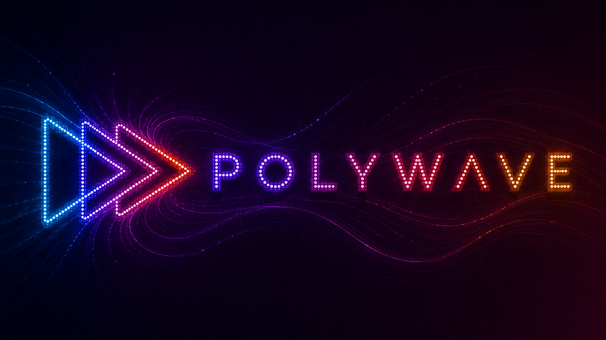

# Polywave Protocol

  

**The coordination protocol for parallel AI agents that guarantees merge-conflict-free execution by construction.**

This repository contains the implementation-agnostic specification of the Polywave protocol. These documents define the coordination rules, correctness guarantees, and behavioral contracts that any Polywave implementation must satisfy, independent of the runtime, LLM provider, or tooling used.

> **Using Claude Code?** Start at [polywave](https://github.com/blackwell-systems/polywave) for the Agent Skill and install guide. This repo is the protocol reference, not the entry point for users.

## The Core Guarantee

No two agents in the same wave own the same file (I1: Disjoint File Ownership). This is not a convention or a preference. It is a hard constraint enforced before any worktree is created. Merge conflicts between parallel agents become structurally impossible.

## Protocol Documents

Read these in order to understand the complete protocol:

| Document | Description |
|----------|-------------|
| [participants.md](participants.md) | Seven participant roles (Orchestrator, Scout, Scaffold Agent, Wave Agent, Integration Agent, Critic Agent, Planner), their execution modes, responsibilities, and forbidden actions |
| [preconditions.md](preconditions.md) | Five preconditions that must hold before the protocol may run |
| [invariants.md](invariants.md) | Six invariants (I1-I6) that must hold throughout protocol execution |
| [execution-rules.md](execution-rules.md) | 49 execution rules (E1-E45, including sub-rules) governing state transitions, agent launches, merge procedures, verification gates, and failure recovery |
| [state-machine.md](state-machine.md) | Protocol states and transitions |
| [message-formats.md](message-formats.md) | IMPL doc and completion report schemas |
| [procedures.md](procedures.md) | Step-by-step procedures for all protocol phases |
| [interview-mode.md](interview-mode.md) | E39: Structured interview mode for deterministic requirements gathering |
| [observability-events.md](observability-events.md) | E40: Observability event emission schema |
| [program-invariants.md](program-invariants.md) | P1-P5: Program-level invariants for multi-IMPL coordination |
| [program-manifest.md](program-manifest.md) | PROGRAM manifest schema for coordinating multiple IMPLs |
| [impl-manifest.schema.json](impl-manifest.schema.json) | JSON Schema for IMPL manifest validation |

## Protocol Guarantees

When all preconditions are met and all invariants hold throughout execution, the protocol guarantees:

- **No merge conflicts** between agents working in the same wave
- **Reproducible verification** via agent-specific gates before merge
- **Human checkpoint enforcement** at suitability gate and REVIEWED state
- **Structured failure recovery** via completion reports, failure taxonomy (E19), and orchestrator escalation
- **Post-wave quality enforcement** via stub detection (E20) and automated quality gates (E21)
- **Interface build safety** via Scaffold Agent build verification before wave launch (E22)

## Implementations

The protocol is designed to be implemented on any platform that can spawn parallel agents and enforce file ownership boundaries.

| Implementation | Platform | Status |
|---------------|----------|--------|
| [polywave](https://github.com/blackwell-systems/polywave) | Claude Code (Agent Skill) | Production |
| [polywave-go](https://github.com/blackwell-systems/polywave-go) | Go SDK + CLI (`polywave-tools`) | Production |
| [polywave-web](https://github.com/blackwell-systems/polywave-web) | Web app (React + Go) | Production |

### Building a New Implementation

1. Read the protocol docs in the order listed above
2. Identify which participant roles your runtime will support (minimum: Orchestrator + Wave Agent)
3. Choose an isolation mechanism that satisfies I1 (disjoint file ownership): git worktrees, filesystem snapshots, containers, etc.
4. Choose an enforcement mechanism for I1 at the tool boundary: pre-execution validation, filesystem permissions, platform-specific hooks, or any mechanism that blocks writes outside an agent's assigned files
5. Implement the state machine transitions (see [state-machine.md](state-machine.md))
6. Implement structured message parsing (see [message-formats.md](message-formats.md))
7. Verify your implementation satisfies all six invariants (see [invariants.md](invariants.md))

The protocol requires that invariants be enforced. It does not prescribe how. Each implementation chooses enforcement mechanisms appropriate to its platform.

## Versioning

This protocol specification follows semantic versioning. Breaking changes to invariants, preconditions, or message formats increment the major version. New optional fields or clarifications increment the minor version.

## License

[MIT OR Apache-2.0](LICENSE)
